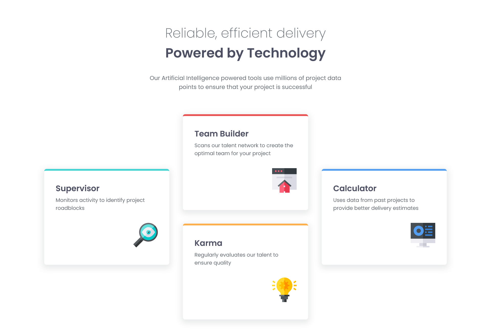

# Frontend Mentor - Four card feature section solution

This is a solution to the [Four card feature section challenge on Frontend Mentor](https://www.frontendmentor.io/challenges/four-card-feature-section-weK1eFYK). Frontend Mentor challenges help you improve your coding skills by building realistic projects. 

## Table of contents

- [Overview](#overview)
  - [The challenge](#the-challenge)
  - [Screenshot](#screenshot)
  - [Links](#links)
- [My process](#my-process)
  - [Built with](#built-with)
  - [Continued development](#continued-development)
- [Author](#author)

## Overview

### The challenge

Users should be able to:

- View the optimal layout for the site depending on their device's screen size

### Screenshot

### Links

- Solution URL: [https://katherin467.github.io/fm-four-card-feature-section/]

## My process

### Built with

- Semantic HTML5 markup
- CSS media queries
- [Less](https://lesscss.org/)
- Flexbox
- Mobile-first workflow

### Continued development

I completed this challenge using flexbox, but I'm less familiar with CSS grid, which may have been another viable solution. I'd like to learn and practice using grid in future projects, as it seems very powerful. 

## Author

- Website - [Katherine Lim](https://katherin467.github.io/)
- Frontend Mentor - [@katherin467](https://www.frontendmentor.io/profile/katherin467)